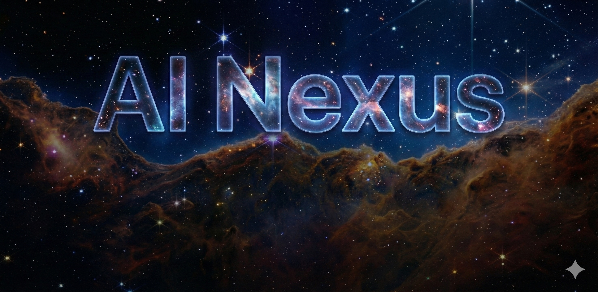
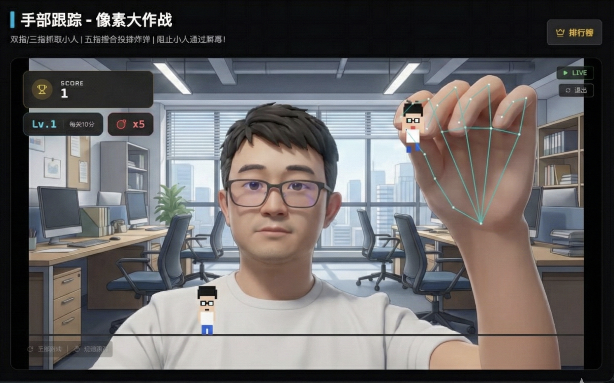

<div align="center">

# AI Nexus / 浏览器端人工智能探索平台

**探索浏览器端人工智能的前沿技术，持续更新 AI 编程与开源项目结合的 Demo**



</div>

---

## 📖 项目简介

**AI Nexus** 是一个专注于浏览器端人工智能技术展示与探索的平台。本平台旨在创造各种 Demo，展示实时计算机视觉、生成式模型以及相关开源项目在 Web 环境下的无限可能性。

我们将持续更新 AI 编程和开源项目结合的 Demo，为开发者提供前沿技术的学习与实践参考。

### 🎯 项目特性

- 🌐 **浏览器端运行** - 所有 Demo 完全在浏览器中运行，无需复杂配置
- 🚀 **AI编程事例** - 整合最新的 AI 开源项目与编程实践
- 🎨 **实时交互体验** - 提供流畅的用户交互与实时反馈
- 📦 **持续更新** - 定期添加新的 AI 编程 Demo 和开源项目集成
- 💡 **学习参考** - 每个 Demo 都经过精心设计，可作为学习参考

## 🎮 当前 Demo

### 1. 手部跟踪 (Hand Tracking)

基于 MediaPipe 的高性能手部骨骼检测 Demo，完全在客户端运行，利用 WebAssembly 和 GPU 加速实现实时交互。



**功能特性：**
- 🤲 实时手部 21 个关键点检测
- ⚡ WebAssembly + GPU 加速
- 🎯 像素大作战交互游戏
- 💾 本地排行榜存储（IndexedDB）

**体验场景：**
- 通过手势控制游戏
- 学习 MediaPipe 在浏览器中的应用
- 了解 WebAssembly 性能优化

---

### 2. YOLO 目标检测

上传图片使用 YOLOv11 模型进行实时目标识别，支持多目标分类与置信度分析。

**功能特性：**
- 🎯 YOLOv11 目标检测模型
- 📸 图片上传（点击或拖拽）
- 📊 多目标分类与置信度分析
- 🔍 实时检测结果可视化

**体验场景：**
- 图像目标识别与分类
- 学习 YOLO 模型在 Web 端的应用
- 了解深度学习模型的部署方式

---

## 🛠️ 技术栈

- **前端框架**: React 19 + TypeScript
- **构建工具**: Vite 6
- **AI 模型**: 
  - MediaPipe Hands（手部跟踪）
  - YOLOv11（目标检测）
- **数据存储**: IndexedDB
- **样式**: Tailwind CSS
- **HTTP 服务**: Python Flask（YOLO Demo 后端）

## 📦 快速开始

### 环境要求

- Node.js 18+ 
- Python 3.8+（用于 YOLO Demo 后端）
- 现代浏览器（支持摄像头 API）

### 安装步骤

1. **克隆项目**
   ```bash
   git clone <repository-url>
   cd ai-nexus
   ```

2. **安装依赖**
   ```bash
   npm install
   ```

3. **配置环境变量**
   
   在项目根目录创建 `.env.local` 文件，设置 `GEMINI_API_KEY`（如果需要使用 Gemini API）：
   ```env
   GEMINI_API_KEY=your_api_key_here
   ```

4. **运行前端项目**
   ```bash
   npm run dev
   ```
   
   访问 `https://localhost:3000`（Vite 会自动配置 HTTPS）

5. **运行 YOLO 后端服务**（可选，仅 YOLO Demo 需要）
   
   进入 `yolo` 目录，参考其中的 README 配置并运行后端服务。

## 🚀 项目规划

本项目将持续更新，计划添加更多 AI 编程与开源项目结合的 Demo：

- 🔄 生成式 LLM 应用
- 🖼️ 图像生成与编辑
- 🎤 语音识别与合成
- 🔍 更多计算机视觉应用
- 💬 自然语言处理 Demo
- 以及其他前沿 AI 技术在浏览器端的实践

## 🤝 贡献

欢迎提交 Issue 和 Pull Request！

## 📄 许可证

本项目采用 MIT 许可证 - 查看 [LICENSE](LICENSE) 文件了解详情

## 🔗 相关链接

- [GitHub 仓库](<repository-url>)
- [问题反馈](<repository-url>/issues)

## ⭐ 如果这个项目对你有帮助，请给个 Star！

---

<div align="center">

**探索浏览器端人工智能的无限可能性** ❤️

Made with ❤️ by AI

</div>